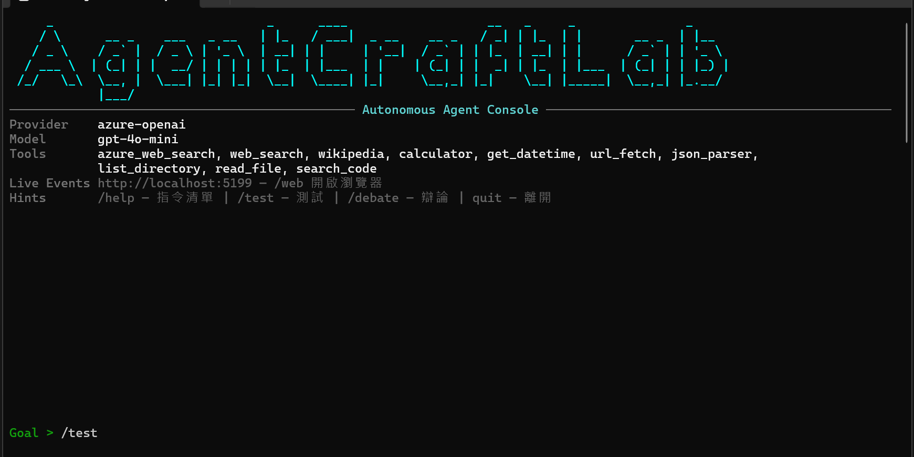
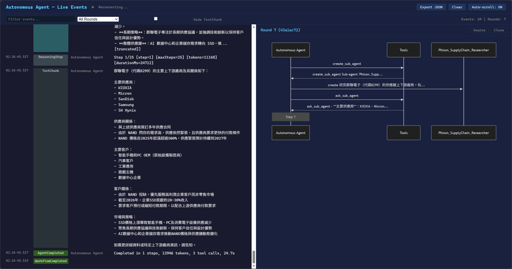

[English](README.en.md) | **繁體中文** | [日本語](README.ja.md)

# AgentCraftLab Autonomous Playground

AI 自主決策代理的互動式控制台 — 基於 ReAct 迴圈架構，支援 Sub-agent 並行協作、工具呼叫、即時視覺化。





## 功能特色

- **ReAct 迴圈** — AI 自主規劃、執行、反思，最多 25 步迭代
- **Sub-agent 並行** — 自動分解任務，建立多個 Sub-agent 同時研究（最多 5 個）
- **10 個內建工具** — Azure Web Search、DuckDuckGo、Wikipedia、URL Fetch、Calculator、JSON Parser、程式碼探索（list_directory / read_file / search_code）
- **Live Events 網頁** — 即時串流所有事件到瀏覽器，支援搜尋過濾、Round 分組、Mermaid 流程圖
- **Context Compaction** — 三層壓縮策略（截斷工具結果 → 本地壓縮 → LLM 摘要），根據模型 context window 動態調整門檻
- **跨 Session 記憶** — Reflexion 模式，從過去的執行經驗中學習
- **Multi-turn 對話** — 多輪累積上下文，`/compact` 手動摘要壓縮
- **@ 檔案參照** — 輸入 `@` 搜尋並引用本地檔案內容

## 前置需求

- [.NET 10 SDK](https://dotnet.microsoft.com/download/dotnet/10.0)
- [Azure OpenAI Service](https://learn.microsoft.com/azure/ai-services/openai/how-to/create-resource) — 需要部署至少一個 GPT 模型（建議 gpt-4o-mini 或 gpt-4o）

## 快速開始

### 1. 設定憑證

編輯 `appsettings.json`：

```json
{
  "AzureOpenAI": {
    "ApiKey": "your-azure-openai-api-key",
    "Endpoint": "https://your-resource.openai.azure.com/",
    "Model": "gpt-4o-mini"
  }
}
```

或使用環境變數：

```bash
export AZURE_OPENAI_KEY="your-key"
export AZURE_OPENAI_ENDPOINT="https://your-resource.openai.azure.com/"
export ORCHESTRATOR_MODEL="gpt-4o-mini"  # 選填，預設 gpt-4o-mini
```

### 2. 執行

```bash
dotnet run
```

### 3. 開始對話

```
Goal > 研究並比較 NVIDIA 和 Tesla 的最新股價走勢，分析利多與利空因素
```

## 指令清單

| 指令 | 說明 |
|------|------|
| `/help` | 顯示所有指令 |
| `/web` | 開啟 Live Events 網頁（http://localhost:5199） |
| `/compact` | 壓縮 Multi-turn 上下文（LLM 摘要） |
| `/flow` | 切換 Execution Flow 圖表顯示 |
| `/status` | 顯示 Session 統計 |
| `/attach <path>` | 附加圖片/檔案（支援多模態） |
| `/memory` | 查看跨 Session 執行記憶 |
| `/reset` | 清除對話上下文 |
| `/clear` | 清除畫面 |
| `/test` | 自動化測試場景 |
| `/debate <topic>` | 辯論模式 |
| `quit` | 離開 |

## Live Events 網頁

啟動後自動在 `http://localhost:5199` 開啟 Web Server。

- **即時串流** — 所有事件（工具呼叫、Sub-agent 互動、Plan、Audit）不截斷不過濾
- **Round 分組** — 每輪對話用交替背景色區分，帶唯一 UUID
- **搜尋過濾** — 文字搜尋 + Round 下拉選單 + Hide TextChunk
- **Flow 流程圖** — 點擊 Round header 的 Flow 按鈕，右側滑出 Mermaid sequence diagram
- **Export JSON** — 匯出結構化事件記錄

## 架構

```
使用者輸入
  → TaskPlanner（複雜目標自動產生執行計劃）
  → SystemPromptBuilder（動態 system prompt + 記憶注入）
  → ReactExecutor（ReAct 迴圈，最多 25 步）
    → MetaToolFactory（8 個 meta-tools：Sub-agent 協作 + 對等審查）
    → FunctionInvokingChatClient（工具呼叫）
    → HybridHistoryManager（三層 Context Compaction）
    → ConvergenceDetector（收斂偵測提前終止）
    → AuditorReflectionEngine（獨立 LLM 審查最終答案）
  → ExecutionMemoryService（Reflexion 反思 + 經驗儲存）
  → IAsyncEnumerable<ExecutionEvent>（串流事件 → Console + SSE）
```

## 環境變數

| 變數 | 說明 | 預設值 |
|------|------|--------|
| `AZURE_OPENAI_KEY` | Azure OpenAI API Key | — |
| `AZURE_OPENAI_ENDPOINT` | Azure OpenAI 端點 | — |
| `ORCHESTRATOR_MODEL` | 主 Agent 使用的模型 | `gpt-4o-mini` |
| `WORKING_DIR` | 程式碼探索工具的根目錄 | 當前目錄 |

## 授權

Copyright 2026 AgentCraftLab

Licensed under the Apache License, Version 2.0. See [LICENSE](LICENSE) for details.
